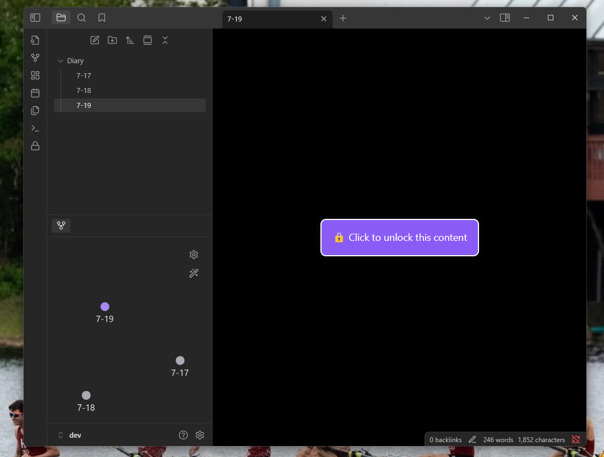
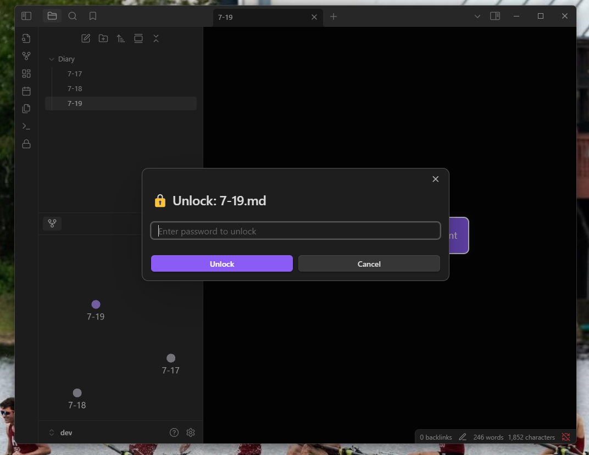
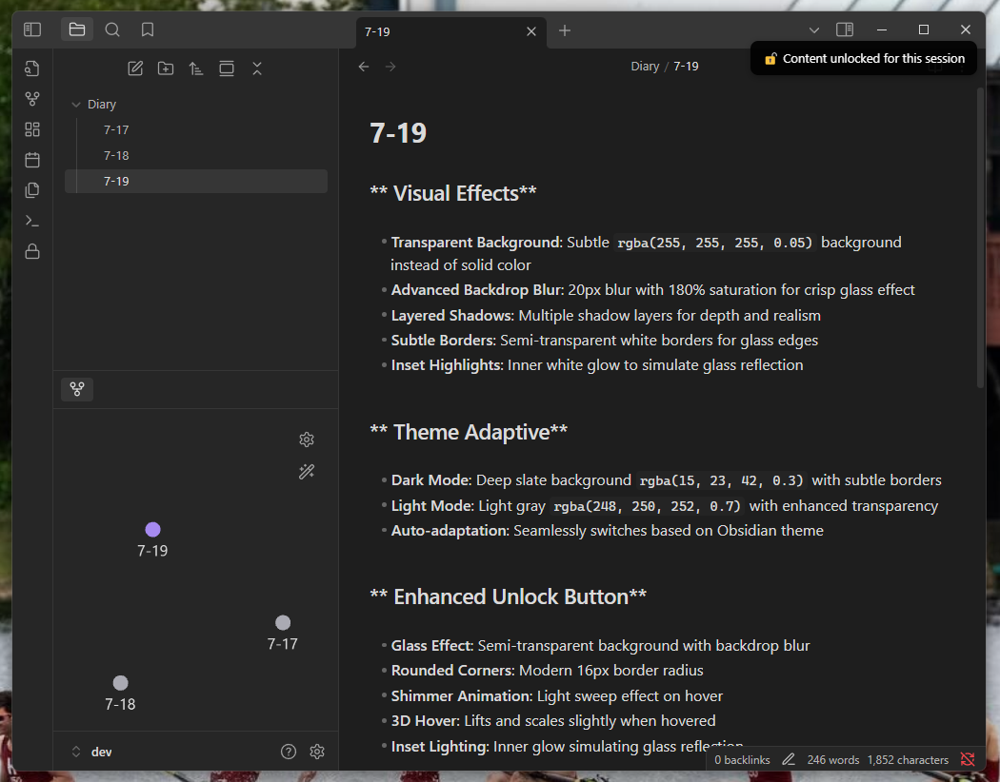

# 🔒 Locket - Obsidian Plugin

<p align="center">
  <a href="https://buymeacoffee.com/mojihad" target="_blank">
    
  </a>
</p>

> **Secure your notes with beautiful glass morphism lock effects**

Locket is a premium Obsidian plugin that allows you to password-protect your files and folders with stunning visual effects. Lock sensitive notes with a beautiful glass morphism overlay that blurs content while maintaining visual appeal.

## ✨ Features

- 🔐 **Password Protection**: Lock individual files or entire folders
- 🎨 **Glass Morphism Effect**: Beautiful transparent overlay with backdrop blur
- 🌙 **Theme Adaptive**: Automatically adapts to dark/light themes
- ⚡ **Session Management**: Unlock once per session or manually re-lock
- 🎯 **Context Menu Integration**: Right-click to lock/unlock items
- ⌨️ **Command Palette**: Quick access via Ctrl+P commands
- 📱 **Responsive Design**: Works beautifully on all screen sizes

## 🖼️ Screenshots

### Glass Morphism Lock Overlay

*Beautiful glass morphism effect that blurs content while maintaining visual appeal*

### Password Unlock Modal

*Clean, modern unlock interface with smooth animations*

### Unlocked Content

*Content revealed with session management and beautiful success notifications*

## 🚀 Installation

### From Obsidian Community Plugins
1. Open **Settings** in Obsidian
2. Navigate to **Community Plugins**
3. Click **Browse** and search for "Locket"
4. Click **Install** and then **Enable**

### Manual Installation
1. Download the latest release from [GitHub Releases](https://github.com/24mjihad/locket/releases)
2. Extract the files to your vault's `.obsidian/plugins/locket/` folder
3. Reload Obsidian and enable the plugin in settings

## 📖 Usage

### Locking Files/Folders
1. **Right-click** on any file or folder in the file explorer
2. Select **"Lock with Locket"** from the context menu
3. Enter a password in the beautiful modal dialog
4. Your content is now secured with a glass morphism overlay

### Unlocking Content
1. **Click** on the glass overlay covering locked content
2. Enter your password in the unlock modal
3. Content unlocks for the current session

### Commands
- `Ctrl+P` → **"Lock current file"** - Lock the active file
- `Ctrl+P` → **"Unlock current file"** - Unlock the active file
- `Ctrl+P` → **"Locket Manager"** - Manage all locked items

## ⚙️ Configuration

Access plugin settings via **Settings** → **Community Plugins** → **Locket**

- 📁 **View Locked Items**: See all your locked files and folders
- 🔧 **Manage Locks**: Remove locks or unlock items
- 📚 **Usage Instructions**: Built-in help and tips

## 🎨 Visual Design

Locket features a modern, premium design with:

- **Glass Morphism Effects**: Stunning transparent overlays with backdrop blur
- **Smooth Animations**: 60fps animations with cubic-bezier easing
- **Theme Integration**: Seamlessly adapts to your Obsidian theme
- **Modern Typography**: Clean, readable fonts with proper spacing
- **Micro-interactions**: Delightful hover effects and transitions

## 🔒 Security

- **Password Hashing**: Passwords are hashed using secure algorithms
- **Session Management**: Unlocked content stays accessible during your session
- **No Data Collection**: All data stays local in your vault
- **Privacy First**: No external connections or data transmission

## 🛠️ Development

This project uses TypeScript and modern web technologies:

```bash
# Install dependencies
npm install

# Development mode
npm run dev

# Build for production
npm run build
```

## 📝 Contributing

Contributions are welcome! Please feel free to submit issues or pull requests.

1. Fork the repository
2. Create a feature branch
3. Commit your changes
4. Push to the branch
5. Open a Pull Request

## 📄 License

This project is licensed under the MIT License - see the [LICENSE](LICENSE) file for details.

## 💖 Support

If you find Locket useful, consider supporting the development:

- ⭐ Star this repository
- 🐛 Report bugs and request features
- 💬 Share with other Obsidian users
- ☕ [Buy me a coffee](https://buymeacoffee.com/mojihad)

---

**Made with ❤️ for the Obsidian community**
